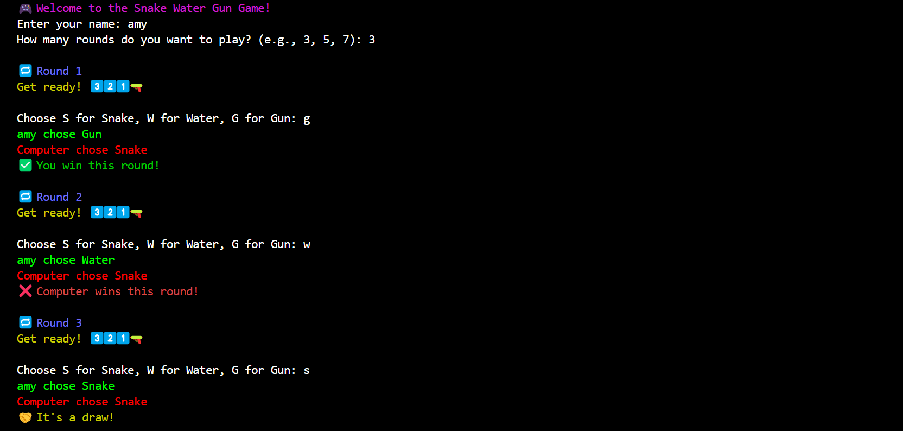
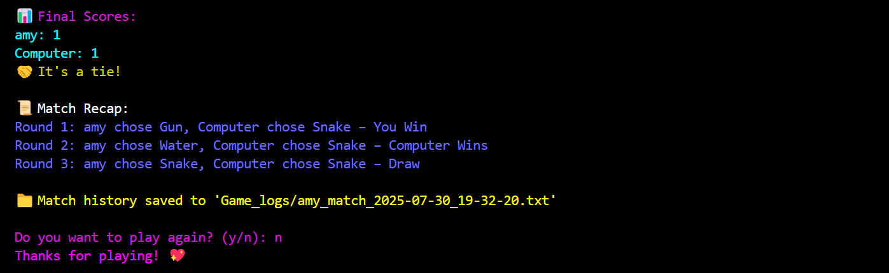

# Snake Water Gun – Python Game 


Welcome to a colorful console twist on the classic **Snake, Water, Gun** game — built using Python!  
Designed with beginner-friendly logic, fun visuals, and clean code for learning and leveling up.

---
## Table of Contents

- [Features](#features)  
- [Preview](#preview)  
- [Getting Started](#getting-started)  
- [Match History](#match-history)  
- [What You'll Learn](#what-youll-learn)  
- [Future Enhancements](#future-enhancements)  
- [License](#license)  
- [Feedback & Support](#feedback--support)

## Features

-  Best-of-N rounds gameplay
-  Smart input validation
-  Score tracking with round recaps
-  Match history auto-saved as a timestamped `.txt` file
-  "Play Again" option
-  Fun ASCII countdown animation
-  Colored console output using `colorama`

---

## Preview

### Gameplay


### Final Score Recap

---

## Getting Started

### 1. Clone the Repository

```bash
git clone https://github.com/yourusername/snake-water-gun-python.git
cd snake-water-gun-python
```

### 2. Install Dependencies
This game uses the colorama library to add colorful output to the console.

```bash
pip install colorama
```
### 3. Run the Game

```bash
python snake_water_gun.py
```
## Match History

After every game, a .txt file like match_history_2025-07-30_17-45-01.txt is created with:
- Round-by-round recap
- Moves made by player & computer
- Final result & scores
Great for review, bragging rights, or debugging.

## What You'll Learn
This project is a cozy way to practice:
- Dictionaries & Logic Mapping 
- Conditional Statements & Loops 
- File I/O in Python 
- Console Animation + Color 
- Clean & modular function-based coding

## Future Enhancements
- GUI version using Tkinter
- Multiplayer or local 2-player mode
- Web version with Flask
- Sound effects or music?

## License
This project is licensed under the MIT License — feel free to use, remix, and share it with credit.
Pull requests are welcome!

## Feedback & Support
If you liked this project or found it helpful:
- Star the repo
- Report bugs or suggest features via Issues
- Drop a sweet comment!

Made with 💖 by Aanchal
